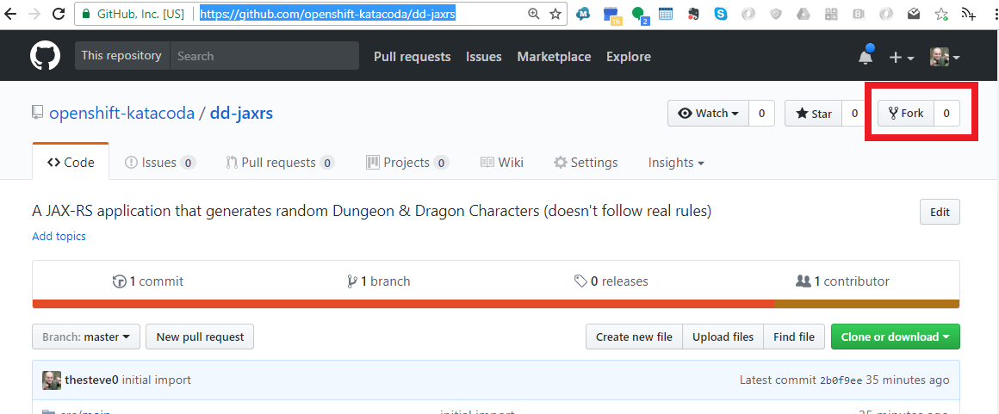

Let's start right off with running some code inside of JBoss EAP. We are going to:

1. Fork a Github repository into your own account
2. Build and run that code in JBoss EAP on OpenShift

## Forking the Github repository

Make sure you are logged into [Github](https://github.com). Then proceed to the [following repository](https://github.com/openshift-katacoda/dd-jaxrs). 
It has a simple [JAX-RS](https://en.wikipedia.org/wiki/Java_API_for_RESTful_Web_Services) service that generates a Dungeon & Dragons 
character when you hit the endpoint. 

On the top right of the Github page you will see a button called "Fork". Please go ahead and select this button and place the 
git fork in one of your Github organizations. 

__NOTE__ If you do not fork the code, you can use the provided repository but you won't be able to do the code change exercise later in this scenario. 

## Getting the clone URL for your fork

Now that you have forked the code we need to get the URL for cloning it. When we do the build in OpenShift, it will clone the repo to the build container
so we need to get the URL. 

On the right side of the page you will see a big green button that says "Clone or Download", go ahead and click it. Please make sure the URL that is in the 
box starts with _https://_ if not please click the use HTTPS link in the box. Now click the click the little clipboard to copy the URL or select and copy it. 

Let's go build some code! 

## Using the OpenShift Web Console to build and deploy your code

Click on the """" on the top of the right pane of the scenario, this will bring you to the OpenShift web console. 
Please login:

**Username:** ``developer``{{copy}}

**Password:** ``developer``{{copy}}

There will be a blue button in the middle of the screen that says "Create Project", go ahead and click it and name your project
_javaftw_ and then click "Create". You are now looking at the OpenShift Catalog. Go ahead and select the Java button:

## Looking at the build logs

## Next s
teps

A web application without a URL is not much fun so let's make a route to our application