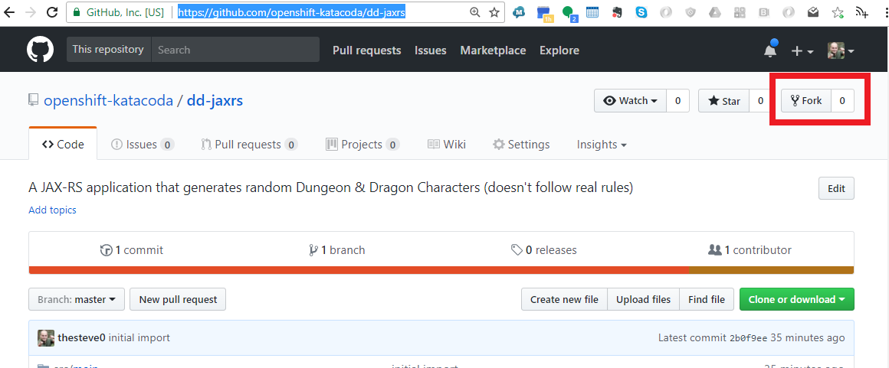
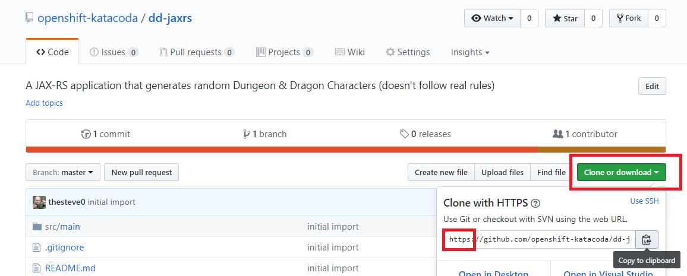

Let's start right off with getting our Gituhub code in order for the rest of the exercises. 
We need to fork a Github repository into your own account and then get the clone URL. 

We will use this URL in the next step to build the application. 

## Forking the Github repository

Make sure you are logged into [Github](https://github.com). Then proceed to the [following repository](https://github.com/openshift-katacoda/dd-jaxrs). 
It has a simple [JAX-RS](https://en.wikipedia.org/wiki/Java_API_for_RESTful_Web_Services) service that generates a Dungeon & Dragons 
character when you hit the endpoint. 

On the top right of the Github page you will see a button called "Fork". Please go ahead and select this button and place the 
git fork in one of your Github organizations. 

__NOTE__ If you do not fork the code, you can use the provided repository but you won't be able to do the code change exercise later in this scenario. 

## Getting the clone URL for your fork

Now that you have forked the code we need to get the URL for cloning it. When we do the build in OpenShift, it will clone the repo to the build container
so we need to get the URL. 

On the right side of the page you will see a big green button that says "Clone or Download", go ahead and click it. Please make sure the URL that is in the 
box starts with _https://_ if not please click the use HTTPS link in the box. Now click the click the little clipboard to copy the URL or select and copy it. 

Let's go build some code! 

