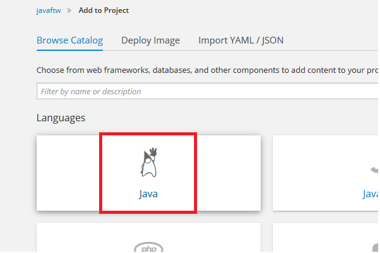
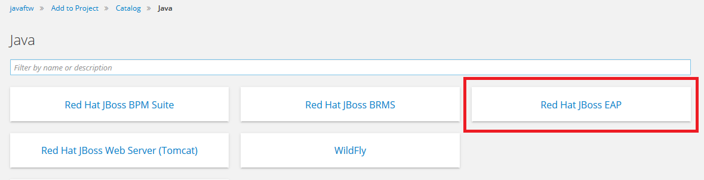
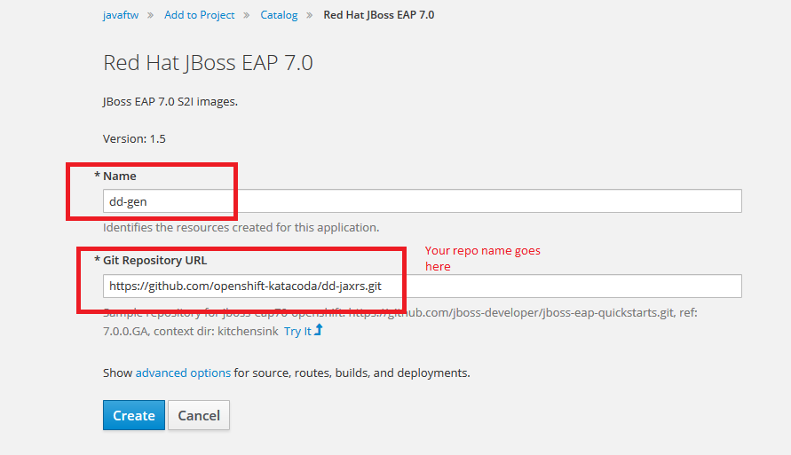

Now that we have done our GitHub work, let's get to building and deploying our application!

## Using the OpenShift Web Console to build and deploy your code

Click on the """" on the top of the right pane of the scenario, this will bring you to the OpenShift web console. 
Please login:

**Username:** ``developer``{{copy}}

**Password:** ``developer``{{copy}}

There will be a blue button in the middle of the screen that says "Create Project", go ahead and click it and name your project
_javaftw_ and then click "Create". You are now looking at the OpenShift Catalog. Go ahead and select the Java button:

 On the next screen you should click on the box for Red Hat JBoss EAP. 
 
 
 
 Go ahead and click "Next" on the resulting screen. This means we are going to use EAP 7.1 and the latest container release. 
 
 You should now be looking at a screen that is asking for your Name and the GitHub URL. Please put dd-gen in the name field and then **YOUR** GitHub repo. URL in the repository box. The screenshot has the default URL which you can use if you don't want to do the code modification in later steps. 
 
  
 
 Once you have filled in the boxes, go ahead and click the "Create" button. 
 
 The resulting screen should tell you that you were successful. Please click on the overview link to go back to your project overview.
 
## Looking at the build logs

## Next steps

